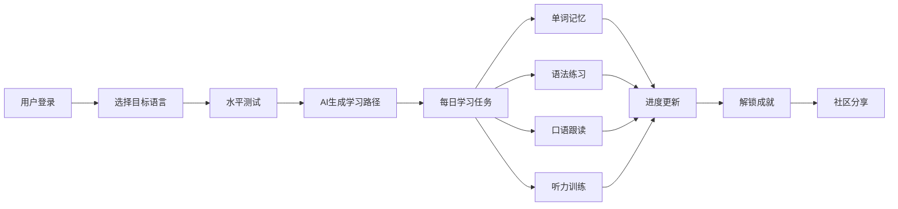
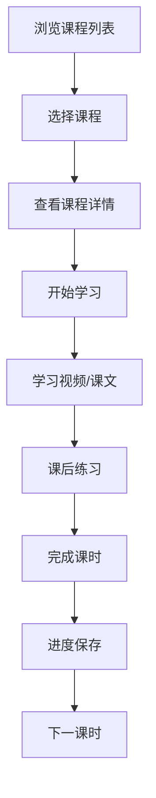

# 多语种在线教育平台产品需求文档

## 1. 产品概述

LinguaVerse 是一款沉浸式多语种在线学习平台，支持英语、日语、韩语等主流语言学习。通过科学的分级课程体系、丰富的互动学习模块和个性化学习路径，为用户打造高效有趣的语言学习体验。

- **核心价值**：让语言学习变得沉浸式、个性化、社交化
- **目标用户**：学生、职场人士、语言爱好者等各年龄段学习者
- **差异化优势**：AI 驱动的个性化路径 + 游戏化成就系统 + 社区互动

## 2. 核心功能

### 2.1 用户角色

| 角色 | 注册方式 | 核心权限 |
|------|----------|----------|
| 学习者 | 邮箱/手机号注册 | 学习课程、参与练习、追踪进度、社区交流、获得成就 |
| 访客 | 无需注册 | 浏览首页、查看课程介绍、体验部分免费内容 |

### 2.2 功能模块

1. **首页**：Hero 区域、语言选择、热门课程、学习数据概览
2. **课程中心**：分级课程体系（入门/初级/中级/高级/精通）、课程详情、课程目录
3. **学习中心**：单词记忆、语法练习、口语跟读、听力训练四大互动模块
4. **学习进度**：学习日历、数据统计、能力雷达图、学习时长追踪
5. **个人中心**：用户资料、学习路径推荐、成就徽章、设置
6. **社区广场**：学习者动态、话题讨论、学习打卡、排行榜
7. **登录/注册**：用户认证、密码找回、个人信息设置

### 2.3 页面详情

| 页面名称 | 模块名称 | 功能描述 |
|----------|----------|----------|
| 首页 | Hero 区域 | 多语言切换动画、平台价值主张、立即学习 CTA |
| 首页 | 语言选择器 | 英语/日语/韩语卡片切换，悬停动效 |
| 首页 | 学习概览 | 今日学习时长、连续学习天数、已学单词数 |
| 首页 | 热门课程 | 精选课程卡片轮播，进度展示 |
| 课程中心 | 分级导航 | 五级课程体系 tab 切换 |
| 课程中心 | 课程列表 | 课程卡片网格，难度标签、时长、评分 |
| 课程详情 | 课程信息 | 课程介绍、讲师、大纲、学员评价 |
| 单词记忆 | 闪卡模式 | 正面单词背面释义，翻转动效，认识/不认识标记 |
| 单词记忆 | 拼写练习 | 听音拼写、选词填空多种题型 |
| 语法练习 | 题目卡片 | 选择题、填空题、句子重组 |
| 语法练习 | 解析反馈 | 错题解析、知识点关联 |
| 口语跟读 | 句子示范 | 原生发音播放、波形可视化 |
| 口语跟读 | 录音评分 | 录音功能、发音准确度评分 |
| 听力训练 | 场景对话 | 情景听力题、逐句精听 |
| 听力训练 | 听写模式 | 听音频写句子 |
| 学习进度 | 学习日历 | 每日学习打卡热力图 |
| 学习进度 | 数据统计 | 学习时长、单词量、正确率趋势图 |
| 学习进度 | 能力雷达 | 听说读写五项能力雷达图 |
| 社区广场 | 动态流 | 学习者打卡、心得分享 |
| 社区广场 | 排行榜 | 学习时长、连续天数排行榜 |
| 个人中心 | 成就徽章 | 已获得/待解锁徽章展示 |
| 个人中心 | 学习路径 | AI 推荐的个性化学习计划 |
| 登录页 | 表单 | 邮箱/密码登录、记住我、忘记密码 |
| 注册页 | 表单 | 用户名、邮箱、密码、目标语言选择 |

## 3. 核心流程

### 3.1 学习主流程

用户注册登录后，选择目标语言，平台进行水平测试并推荐个性化学习路径。用户每日按照推荐路径学习，完成单词、语法、口语、听力等互动练习，系统自动追踪学习进度并更新数据，同时解锁成就徽章，可在社区分享学习成果。

### 3.2 课程学习流程

## 4. 用户界面设计

### 4.1 设计风格

**设计理念**：沉浸式学习 · 温暖活力 · 现代精致

- **主色调**：渐变紫罗兰 `#6366f1 → #8b5cf6` —— 象征智慧与探索
- **辅助色**：
  - 活力橙 `#f97316` —— 强调互动与能量
  - 清新绿 `#10b981` —— 代表进步与成就
  - 温柔粉 `#ec4899` —— 增添温暖感
- **中性色**：深邃炭灰 `#0f172a` 到 云石白 `#f8fafc` 的完整灰度体系
- **按钮风格**：圆角胶囊形按钮，渐变填充，悬停时上浮+发光
- **字体**：
  - 标题：`"Playfair Display", "Noto Serif SC", serif` —— 优雅有格调
  - 正文：`"DM Sans", "PingFang SC", sans-serif` —— 现代易读
- **布局风格**：卡片式布局，玻璃拟态效果，柔和阴影，大量留白
- **图标风格**：Lucide 线性图标，统一 1.5px 线宽
- **动效**：页面切换淡入淡出，卡片悬停微上浮，学习进度流畅动画

### 4.2 页面设计概览

| 页面名称 | 模块名称 | UI 元素 |
|----------|----------|---------|
| 首页 | Hero 区域 | 渐变背景、浮动语言卡片、打字机效果标题、玻璃态 CTA |
| 首页 | 学习概览 | 三栏数据卡片、环形进度条、连续打卡火焰图标 |
| 课程中心 | 分级导航 | 阶梯式 tab 设计，激活态渐变高亮 |
| 单词记忆 | 闪卡 | 3D 翻转动效，正面单词+音标，背面释义+例句 |
| 学习进度 | 热力图 | 年度学习日历热力图，颜色深浅表示学习时长 |
| 学习进度 | 雷达图 | 五维能力雷达，流畅填充动画 |
| 个人中心 | 成就墙 | 徽章网格，已获得彩色显示，未获得灰色锁定 |
| 社区广场 | 动态卡片 | 用户头像、打卡内容、点赞评论交互 |

### 4.3 响应式设计

- **设计策略**：桌面端优先，移动端自适应
- **断点设置**：
  - 桌面端：`≥1280px` —— 四栏布局，最大内容宽度 1200px
  - 平板端：`768px - 1279px` —— 两栏/三栏布局
  - 移动端：`<768px` —— 单栏布局，底部导航栏
- **触摸优化**：移动端按钮最小高度 44px，间距适配手指点击

### 4.4 视觉特色

- **沉浸式背景**：主页面采用渐变+噪点纹理背景，营造氛围
- **玻璃拟态**：导航栏、卡片采用 backdrop-blur 毛玻璃效果
- **微动效**：滚动触发渐入、悬停缩放、进度条生长动画
- **学习仪式感**：完成练习时的庆祝动画、成就解锁的粒子特效
