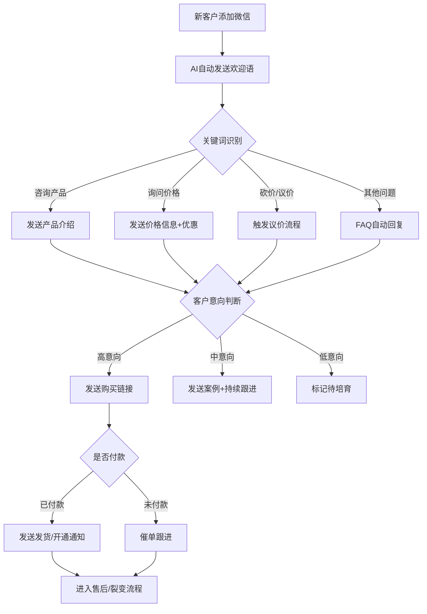
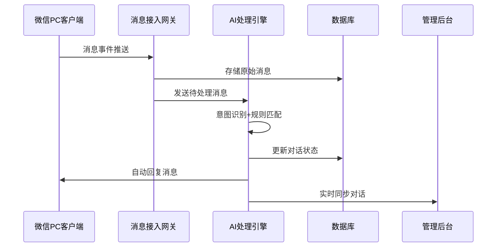

# 自动营销系统（微信PC版 + AI自动回复）PRD V1.0

## 1. 产品概述

**项目定位**：打造一套获客 → 私聊 → 筛选 → 成交 → 裂变全流程自动化营销系统。

**核心价值**：用户无需人工回复，系统自动识别客户意图，自动完成接待、介绍产品、回答问题、发送链接、收款引导、成交跟进、二次营销等全流程。

**目标用户**：
- AI工具推广者
- 创业项目开发者
- 算命/玄学项目运营者
- 数字产品销售商
- 知识付费课程方
- 社群招生负责人
- 软件销售商

## 2. 核心功能

### 2.1 用户角色

| 角色 | 说明 | 核心权限 |
|------|------|----------|
| 管理员 | 系统运营者 | 完整系统配置、AI规则设置、对话监控、数据统计 |
| 操作员 | 客服替代者 | 监控对话、手动介入、素材管理 |

### 2.2 功能模块

1. **控制台首页**：系统状态概览、今日数据统计、待处理事项、智能体运行状态
2. **客户管理**：客户列表、客户画像、对话记录、意向分级
3. **AI智能体**：知识库配置、回复规则、流程设计、敏感词过滤
4. **素材中心**：话术模板、产品链接、图片/视频素材
5. **数据分析**：获客漏斗、转化率、对话质量、ROI统计
6. **系统设置**：微信接入、支付配置、通知设置

### 2.3 页面详情

| 页面名称 | 模块名称 | 功能描述 |
|----------|----------|----------|
| 控制台首页 | 数据概览 | 展示今日新增客户、对话数、转化率、成交金额等核心指标卡片 |
| 控制台首页 | 智能体状态 | 显示AI智能体运行状态、在线时长、响应速度 |
| 控制台首页 | 待处理事项 | 需要人工介入的对话列表 |
| 客户管理 | 客户列表 | 展示所有客户，支持筛选、搜索、分组 |
| 客户管理 | 客户详情 | 查看客户画像、对话历史、购买记录、标签 |
| AI智能体 | 知识库 | 配置产品知识、FAQ、常见问题答案 |
| AI智能体 | 流程设计 | 可视化流程编排，配置自动回复逻辑 |
| AI智能体 | 规则配置 | 关键词触发、转人工条件、敏感词过滤 |
| 素材中心 | 素材库 | 管理产品图片、视频、文案模板 |
| 素材中心 | 话术模板 | 预设各类场景的标准话术 |
| 数据分析 | 漏斗分析 | 展示获客→私聊→筛选→成交各环节转化 |
| 数据分析 | 对话质检 | AI分析对话质量，标记优秀/问题对话 |
| 系统设置 | 微信接入 | 配置微信PC版接入、消息推送设置 |
| 系统设置 | 支付配置 | 支付宝/微信支付收款码配置 |

## 3. 核心流程

### 3.1 客户接待流程

### 3.2 微信PC版消息接入流程

## 4. 用户界面设计

### 4.1 设计风格

- **主题色调**：深蓝科技风 (#0A1628) + 霓虹紫渐变 (#6366F1 → #8B5CF6)
- **辅助色**：薄荷绿 (#10B981) 用于成功状态，金橙色 (#F59E0B) 用于警告/待处理
- **按钮风格**：圆角卡片式，hover时有微光扫过效果
- **字体**：思源黑体(UI) + 霞鹜文楷(标题点缀)
- **布局**：左侧固定导航 + 右侧内容区，支持深色/浅色切换
- **图标**：线性图标风格，hover时填充变化

### 4.2 页面设计概览

| 页面名称 | 模块名称 | UI元素 |
|----------|----------|--------|
| 控制台首页 | 数据卡片 | 玻璃拟态背景，圆角16px，hover微缩放1.02 |
| 控制台首页 | 状态指示 | 脉冲动画圆点表示在线状态 |
| 客户列表 | 表格 | 斑马纹行，hover行高亮 |
| AI智能体 | 流程画布 | 节点拖拽连接，线条贝塞尔曲线 |
| 对话界面 | 气泡 | 左对齐客户消息(深色)，右对齐AI回复(渐变) |

### 4.3 响应式策略

- **桌面端优先** (1920px → 1440px → 1280px)
- **平板适配** (1024px → 768px)：侧边栏折叠为图标
- **移动端** (375px+)：底部Tab导航，全屏对话模式

### 4.4 动效设计

- 页面切换：淡入淡出 + 轻微上移 (300ms ease-out)
- 数据加载：骨架屏 + 数据渐显
- 按钮交互：点击涟漪效果
- 通知提示：从右侧滑入 + 脉冲动画

## 5. 技术备注

### 5.1 微信PC版接入说明

微信PC版消息接入需要使用Windows Hook技术实现，存在以下技术限制：
- 仅支持Windows操作系统
- 需要目标PC端运行消息捕获程序
- 消息通过WebSocket实时转发至后台处理

### 5.2 AI处理引擎

- 意图识别：关键词匹配 + 简单规则引擎
- 回复生成：模板填充 + 变量替换
- 后续可扩展接入大模型API提升智能化程度

### 5.3 安全考量

- 消息数据加密传输
- 管理员操作日志记录
- 敏感信息脱敏存储
- 支付链接防篡改校验
