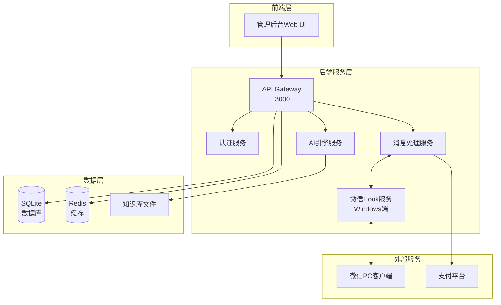
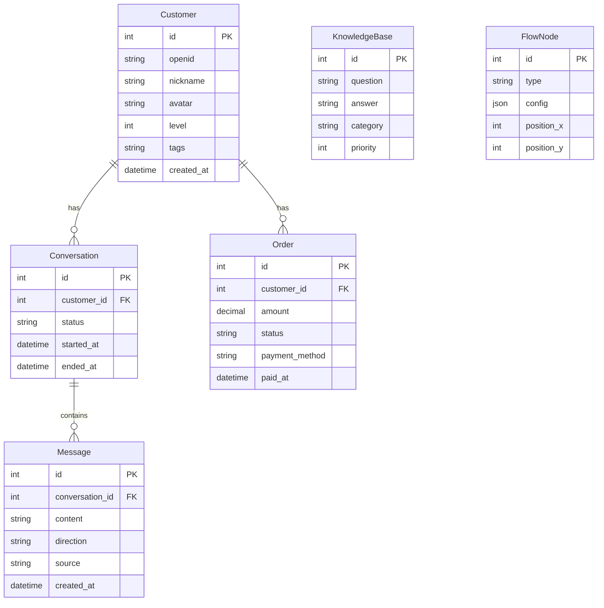
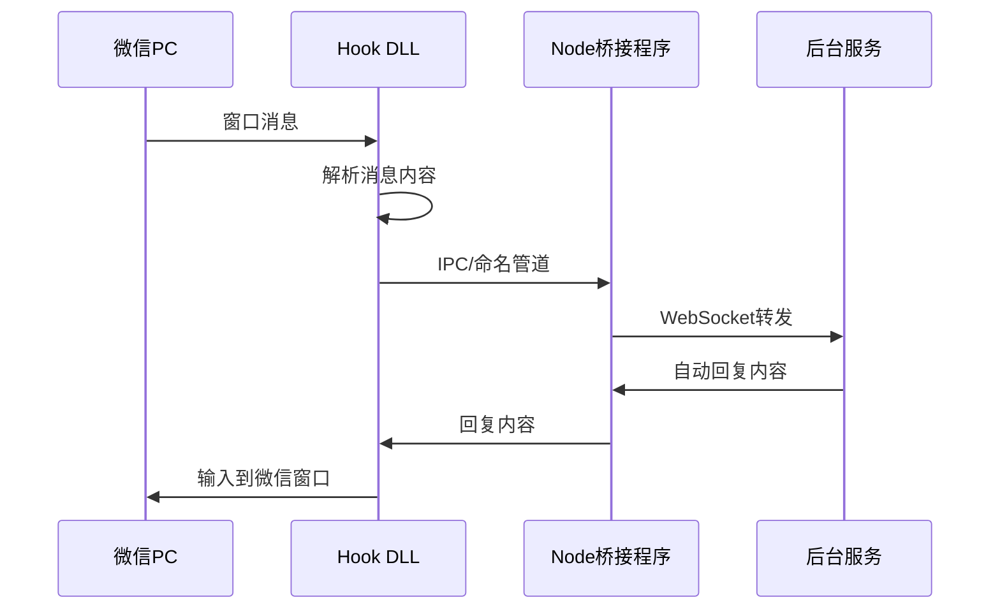

# 自动营销系统 技术架构文档 V1.0

## 1. 架构设计



## 2. 技术选型

### 2.1 前端技术栈

| 类别 | 技术 | 版本 |
|------|------|------|
| 框架 | React | 18.x |
| 构建工具 | Vite | 5.x |
| UI框架 | TailwindCSS | 3.x |
| 状态管理 | Zustand | 4.x |
| 图表库 | Recharts | 2.x |
| 拖拽库 | @dnd-kit | 6.x |
| 图标 | Lucide React | 最新 |

### 2.2 后端技术栈

| 类别 | 技术 | 版本 |
|------|------|------|
| 运行时 | Node.js | 20.x |
| 框架 | Express | 4.x |
| 数据库 | SQLite | 3.x |
| 缓存 | Redis (可选) | 7.x |
| WebSocket | ws | 8.x |
| 微信Hook | C++ Windows程序 | - |

### 2.3 项目初始化

```
npm create vite@latest marketing-system -- --template react-ts
cd marketing-system
npm install
npm install tailwindcss postcss autoprefixer
npx tailwindcss init -p
npm install zustand axios react-router-dom lucide-react recharts @dnd-kit/core @dnd-kit/sortable
npm install -D @types/node
```

## 3. 路由定义

| 路由 | 页面 | 说明 |
|------|------|------|
| / | /pages/Dashboard | 控制台首页 |
| /customers | /pages/Customers | 客户列表 |
| /customers/:id | /pages/CustomerDetail | 客户详情 |
| /ai-agent | /pages/AIAgent | AI智能体配置 |
| /ai-agent/knowledge | /pages/KnowledgeBase | 知识库管理 |
| /ai-agent/flow | /pages/FlowDesigner | 流程设计器 |
| /materials | /pages/Materials | 素材中心 |
| /analytics | /pages/Analytics | 数据分析 |
| /settings | /pages/Settings | 系统设置 |

## 4. 数据模型

### 4.1 实体关系图



### 4.2 数据库DDL

```sql
-- 客户表
CREATE TABLE customers (
    id INTEGER PRIMARY KEY AUTOINCREMENT,
    openid TEXT UNIQUE NOT NULL,
    nickname TEXT,
    avatar TEXT,
    level INTEGER DEFAULT 0,
    tags TEXT,
    created_at DATETIME DEFAULT CURRENT_TIMESTAMP
);

-- 对话表
CREATE TABLE conversations (
    id INTEGER PRIMARY KEY AUTOINCREMENT,
    customer_id INTEGER NOT NULL,
    status TEXT DEFAULT 'active',
    started_at DATETIME DEFAULT CURRENT_TIMESTAMP,
    ended_at DATETIME,
    FOREIGN KEY (customer_id) REFERENCES customers(id)
);

-- 消息表
CREATE TABLE messages (
    id INTEGER PRIMARY KEY AUTOINCREMENT,
    conversation_id INTEGER NOT NULL,
    content TEXT NOT NULL,
    direction TEXT NOT NULL,
    source TEXT DEFAULT 'ai',
    created_at DATETIME DEFAULT CURRENT_TIMESTAMP,
    FOREIGN KEY (conversation_id) REFERENCES conversations(id)
);

-- 订单表
CREATE TABLE orders (
    id INTEGER PRIMARY KEY AUTOINCREMENT,
    customer_id INTEGER NOT NULL,
    amount DECIMAL(10,2) NOT NULL,
    status TEXT DEFAULT 'pending',
    payment_method TEXT,
    paid_at DATETIME,
    FOREIGN KEY (customer_id) REFERENCES customers(id)
);

-- 知识库表
CREATE TABLE knowledge_base (
    id INTEGER PRIMARY KEY AUTOINCREMENT,
    question TEXT NOT NULL,
    answer TEXT NOT NULL,
    category TEXT,
    priority INTEGER DEFAULT 0
);

-- 流程节点表
CREATE TABLE flow_nodes (
    id INTEGER PRIMARY KEY AUTOINCREMENT,
    type TEXT NOT NULL,
    config TEXT,
    position_x INTEGER DEFAULT 0,
    position_y INTEGER DEFAULT 0
);

-- 话术模板表
CREATE TABLE templates (
    id INTEGER PRIMARY KEY AUTOINCREMENT,
    name TEXT NOT NULL,
    content TEXT NOT NULL,
    category TEXT,
    created_at DATETIME DEFAULT CURRENT_TIMESTAMP
);

-- 索引
CREATE INDEX idx_customers_openid ON customers(openid);
CREATE INDEX idx_conversations_customer ON conversations(customer_id);
CREATE INDEX idx_messages_conversation ON messages(conversation_id);
CREATE INDEX idx_orders_customer ON orders(customer_id);
```

## 5. API接口定义

### 5.1 客户接口

```typescript
// 获取客户列表
GET /api/customers
Query: { page?: number, limit?: number, search?: string, level?: number }
Response: {
  list: Customer[],
  total: number,
  page: number,
  limit: number
}

// 获取客户详情
GET /api/customers/:id
Response: {
  customer: Customer,
  conversations: Conversation[],
  orders: Order[]
}

// 更新客户标签
PUT /api/customers/:id/tags
Body: { tags: string[] }
Response: { success: boolean }
```

### 5.2 对话接口

```typescript
// 获取客户对话列表
GET /api/conversations/:customerId
Response: {
  list: Conversation[],
  messages: Record<number, Message[]>
}

// 发送消息(手动介入)
POST /api/messages/send
Body: { customerId: number, content: string }
Response: { success: boolean, message: Message }

// 获取实时对话(WebSocket)
WS /ws/conversation
Event: { type: 'message', data: Message }
```

### 5.3 AI智能体接口

```typescript
// 获取知识库
GET /api/knowledge
Query: { category?: string }
Response: { list: KnowledgeItem[] }

// 添加知识
POST /api/knowledge
Body: { question: string, answer: string, category?: string }
Response: { id: number }

// 获取流程配置
GET /api/flow
Response: { nodes: FlowNode[] }

// 保存流程配置
PUT /api/flow
Body: { nodes: FlowNode[] }
Response: { success: boolean }
```

### 5.4 统计接口

```typescript
// 获取统计数据
GET /api/analytics/dashboard
Response: {
  todayCustomers: number,
  todayConversations: number,
  todayOrders: number,
  conversionRate: number,
  funnelData: FunnelItem[]
}

// 获取漏斗数据
GET /api/analytics/funnel
Response: {
  stages: string[],
  counts: number[]
}
```

## 6. 微信Hook服务架构

### 6.1 架构说明

微信Hook服务运行在Windows机器上，作为消息捕获和转发的桥接层。

### 6.2 技术实现

- 使用Windows Hook API捕获微信窗口消息
- 通过C++编写动态链接库实现底层捕获
- Node.js通过child_process与C++程序通信
- WebSocket将消息转发至后台服务

### 6.3 通信流程



## 7. 目录结构

```
marketing-system/
├── src/
│   ├── components/
│   │   ├── common/          # 通用组件
│   │   ├── layout/          # 布局组件
│   │   ├── dashboard/      # 控制台组件
│   │   ├── customer/        # 客户管理组件
│   │   ├── ai-agent/        # AI智能体组件
│   │   └── analytics/      # 数据分析组件
│   ├── pages/               # 页面组件
│   ├── stores/              # Zustand状态
│   ├── services/            # API服务
│   ├── hooks/                # 自定义Hooks
│   ├── utils/               # 工具函数
│   ├── types/               # TypeScript类型
│   └── App.tsx
├── server/
│   ├── index.js             # Express入口
│   ├── routes/              # 路由
│   ├── services/            # 业务逻辑
│   ├── db/                  # 数据库
│   └── ws/                  # WebSocket
├── hook/                    # Windows Hook程序
│   ├── dll/
│   └── bridge/
└── package.json
```
