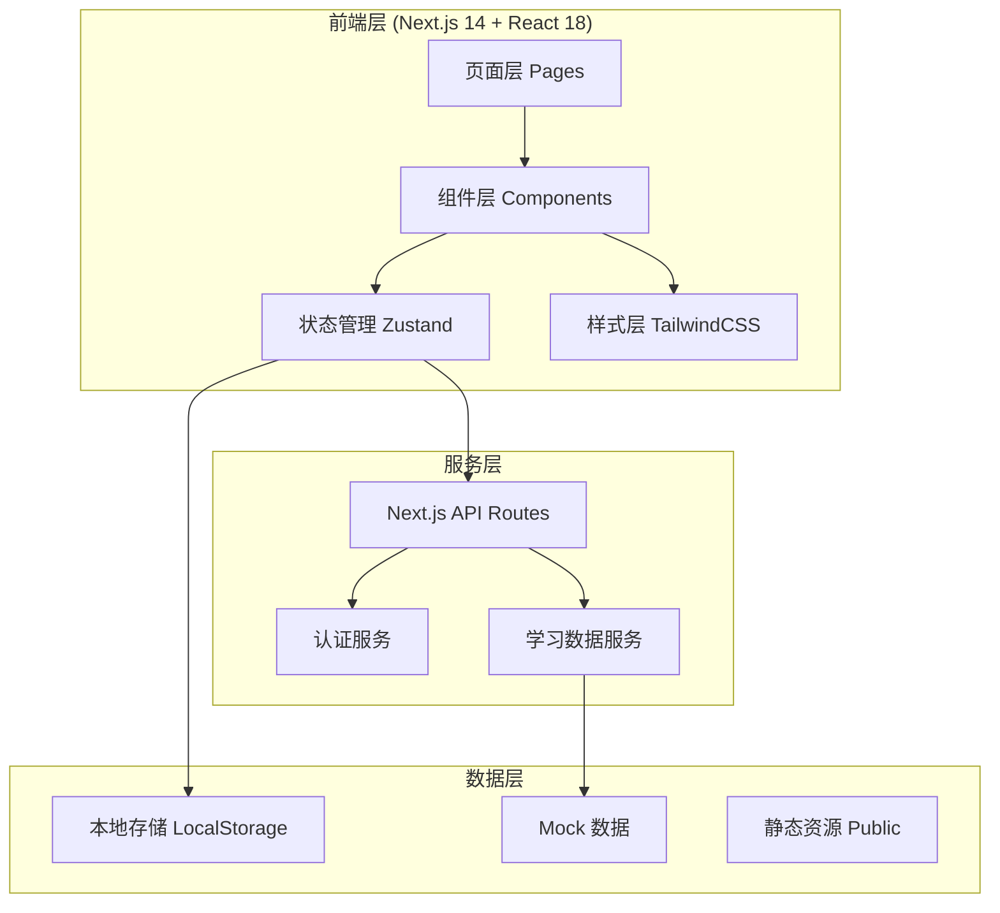
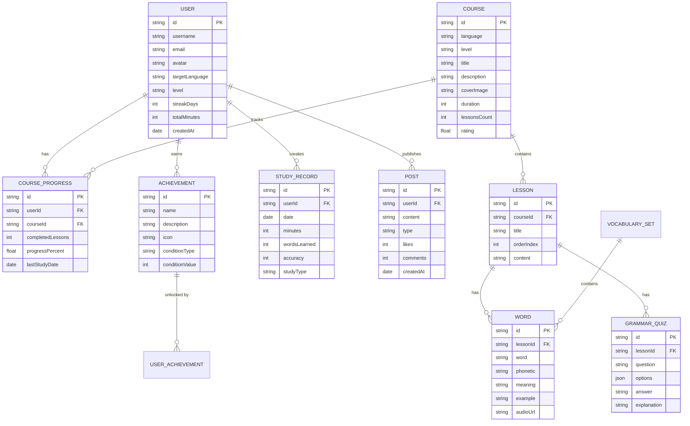
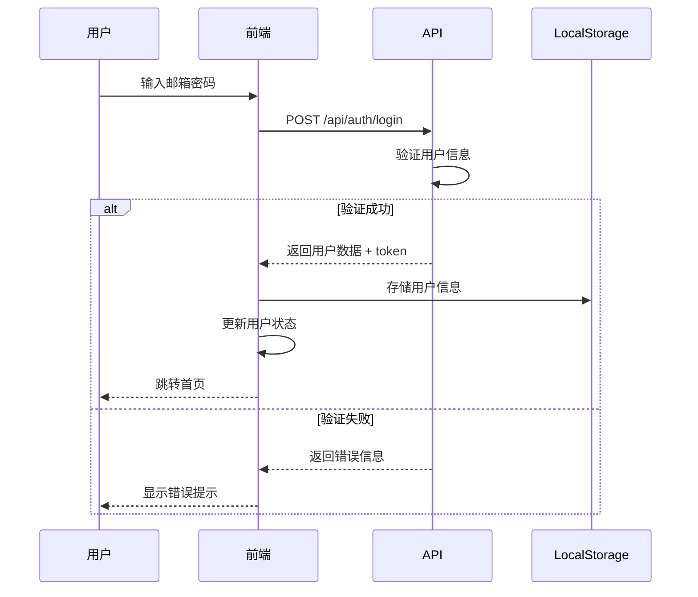

# 多语种在线教育平台技术架构文档

## 1. 架构设计



## 2. 技术栈说明

- **前端框架**：Next.js 14 (App Router) + React 18 + TypeScript
- **样式方案**：TailwindCSS 3.4 + CSS Variables
- **状态管理**：Zustand
- **图标库**：lucide-react
- **数据可视化**：recharts
- **数据持久化**：LocalStorage + IndexedDB
- **后端接口**：Next.js API Routes（模拟数据）
- **部署方式**：Vercel / Docker

## 3. 路由定义

| 路由路径 | 页面名称 | 功能说明 |
|----------|----------|----------|
| `/` | 首页 | 平台展示、语言选择、学习概览、热门课程 |
| `/courses` | 课程中心 | 分级课程列表、课程筛选 |
| `/courses/[id]` | 课程详情 | 课程信息、大纲、开始学习 |
| `/learn/vocabulary` | 单词记忆 | 闪卡学习、拼写练习 |
| `/learn/grammar` | 语法练习 | 语法题目、错题解析 |
| `/learn/speaking` | 口语跟读 | 发音示范、录音评分 |
| `/learn/listening` | 听力训练 | 场景听力、听写模式 |
| `/progress` | 学习进度 | 学习日历、数据统计、能力雷达 |
| `/community` | 社区广场 | 动态流、排行榜、话题讨论 |
| `/profile` | 个人中心 | 用户资料、成就徽章、学习路径 |
| `/login` | 登录页 | 用户登录 |
| `/register` | 注册页 | 用户注册 |

## 4. 数据模型

### 4.1 实体关系图



### 4.2 状态管理

```typescript
// 用户状态
interface UserState {
  user: User | null;
  isLoggedIn: boolean;
  login: (email: string, password: string) => Promise<void>;
  register: (data: RegisterData) => Promise<void>;
  logout: () => void;
  updateProfile: (data: Partial<User>) => void;
}

// 学习状态
interface LearningState {
  currentLanguage: string;
  currentLevel: string;
  dailyGoal: number;
  todayMinutes: number;
  wordsLearned: number;
  streakDays: number;
  studyRecords: StudyRecord[];
  achievements: UserAchievement[];
  addStudyTime: (minutes: number) => void;
  completeLesson: (lessonId: string) => void;
  checkAchievements: () => void;
}

// 课程状态
interface CourseState {
  courses: Course[];
  currentCourse: Course | null;
  courseProgress: CourseProgress[];
  fetchCourses: (language?: string, level?: string) => void;
  enrollCourse: (courseId: string) => void;
}
```

## 5. 核心组件结构

```
src/
├── app/
│   ├── layout.tsx          # 根布局
│   ├── page.tsx            # 首页
│   ├── globals.css         # 全局样式
│   ├── courses/            # 课程模块
│   ├── learn/              # 学习模块
│   ├── progress/           # 进度模块
│   ├── community/          # 社区模块
│   ├── profile/            # 个人中心
│   ├── login/              # 登录
│   └── register/           # 注册
├── components/
│   ├── layout/             # 布局组件
│   │   ├── Header.tsx
│   │   ├── Footer.tsx
│   │   ├── Sidebar.tsx
│   │   └── MobileNav.tsx
│   ├── common/             # 通用组件
│   │   ├── Button.tsx
│   │   ├── Card.tsx
│   │   ├── ProgressRing.tsx
│   │   └── Badge.tsx
│   ├── home/               # 首页组件
│   ├── courses/            # 课程组件
│   ├── learn/              # 学习组件
│   ├── progress/           # 进度组件
│   ├── community/          # 社区组件
│   └── profile/            # 个人中心组件
├── store/                  # 状态管理
│   ├── useUserStore.ts
│   ├── useLearningStore.ts
│   └── useCourseStore.ts
├── data/                   # Mock 数据
│   ├── courses.ts
│   ├── vocabulary.ts
│   ├── grammar.ts
│   ├── achievements.ts
│   └── community.ts
├── types/                  # 类型定义
│   ├── index.ts
│   └── models.ts
└── utils/                  # 工具函数
    ├── storage.ts
    ├── helpers.ts
    └── date.ts
```

## 6. 认证流程



## 7. 性能优化策略

1. **代码分割**：基于路由的代码分割，首屏加载优化
2. **图片优化**：Next.js Image 组件自动优化
3. **状态持久化**：学习数据本地缓存，减少重复请求
4. **动画优化**：CSS transforms + opacity，避免重排重绘
5. **虚拟列表**：长列表数据虚拟化渲染
6. **预加载**：关键资源预加载，提升后续页面切换速度
